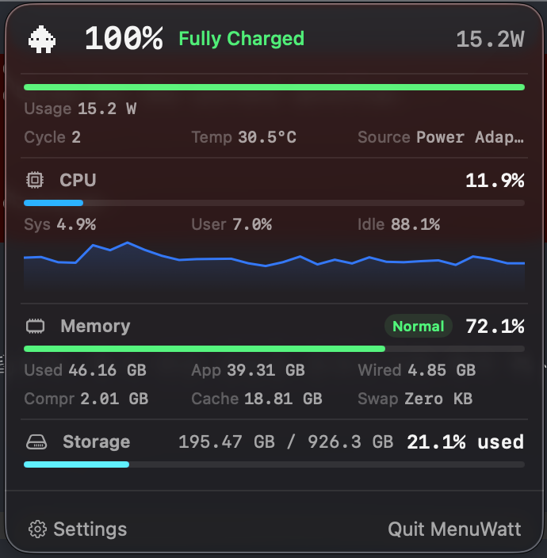

# MenuWatt

A lightweight macOS menu bar app that shows real-time power usage, battery status, and system metrics.



## Install

**Homebrew:**

```bash
brew tap Ketchio-dev/menuwatt
brew install --cask menuwatt
```

**Manual:** Download `MenuWatt.dmg` from the [latest release](https://github.com/Ketchio-dev/MenuWatt/releases/latest), open it, and drag to Applications.

> On first launch, macOS may block the app. Run `xattr -cr /Applications/MenuWatt.app` or go to **System Settings > Privacy & Security > Open Anyway**.

## Features

- Live system power (W) in the menu bar
- Battery percentage, charge rate, cycle count, temperature
- CPU usage with history graph
- Memory pressure and breakdown
- Storage usage
- Animated pixel character that speeds up with system load

## How It Works

MenuWatt reads system power directly from the **SMC** (System Management Controller) via IOKit. Battery metadata comes from `AppleSmartBattery` in the IOKit registry. CPU and memory stats use Mach `host_statistics`. No background daemons, no network calls, no runtime dependencies.

Works on all Apple Silicon Macs (M1-M5) without root privileges.

## Development

```bash
./scripts/test.sh         # Run tests
./scripts/build-app.sh    # Build release .app
./scripts/package-dmg.sh  # Package DMG
```

Requires Xcode and [xcodegen](https://github.com/yonaskolb/XcodeGen).

## Support

Questions, bug reports, or feature requests:

- [GitHub Issues](https://github.com/Ketchio-dev/MenuWatt/issues)
- [Discord community](https://discord.gg/Cc2RGrN7dh)

## License

[MIT](LICENSE)
